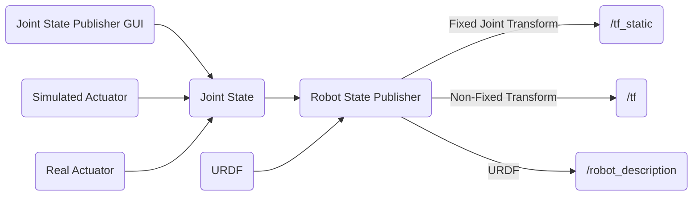

# Rover
<!-- ![GitHub Actions Workflow Status] -->


## URDF Workflow


## Features

## Getting Started

### Setting up Development Enviorment
To set up your development environment, follow these steps:

1. Install Visual Studio Code (VS Code):
- Download and install VS Code from the [official website](https://code.visualstudio.com/).

2. Install Docker:
- Download and install Docker Desktop from the [official website](https://www.docker.com/products/docker-desktop/).

3. Install Remote Development Extension for Visual Studio Code:

- Open VS Code.
- Go to the Extensions view by clicking on the square icon in the sidebar or pressing Ctrl+Shift+X.
- Search for "Remote Development" in the Extensions Marketplace.
- Click on "Install" to install the Remote Development extension.
- Restart VS Code after installation is complete.


### Cloning the Repository
To get started with the project, follow these steps:

1. Clone the repository to your local machine:
    ```bash
    git clone https://github.com/Gagan-Space/Rover.git
    ```
2. Open the project in Visual Studio Code (VS Code):
- Launch VS Code.
- Click on "File" > "Open Folder...".
- Navigate to the directory where you cloned the repository (Cansat-Flight-Software) and select it.
- The project will open in VS Code.

3. Reopen the project in a Development Container:

- With the project open in VS Code, press Ctrl+Shift+P (or Cmd+Shift+P on macOS) to open the command palette.
- Type "Reopen Folder in Container" and select the option when it appears.
- VS Code will rebuild the development container based on the configuration provided in the repository.

## Contributing

We welcome contributions from the community! If you'd like to contribute, please follow these guidelines:

1. Fork the repository
2. Create your feature branch: 
    ```bash
    git checkout -b feature-name
    ```
3. Commit your changes:
    ```bash
    git commit -am 'Add some feature'
    ```

4. Push to the branch: 
    ``` bash
    git push origin feature-name
    ```
5. Submit a pull request

For major changes, please open an issue first to discuss what you would like to change.