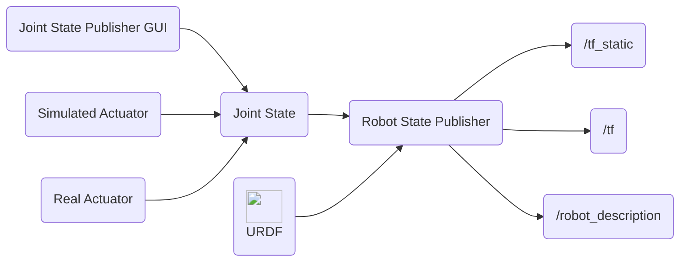

The following code-block will be rendered as a Mermaid diagram:

```mermaid
flowchart LR
    A(Joint State Publisher GUI)
    B(Joint State)
    C(Simulated Actuator)
    D(Real Actuator)
    E(Robot State Publisher)
    F(<img src='https://iconscout.com/ms-icon-310x310.png' width='40' height='40' /> URDF)
    G(/tf_static)
    H(/tf)
    I(/robot_description)

    A --> B
    C --> B
    D --> B
    B --> E
    F --> E
    E --> G
    E --> H
    E --> I
```
